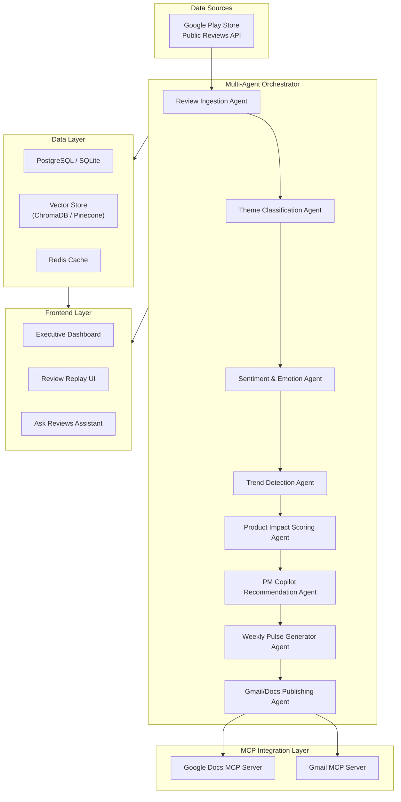
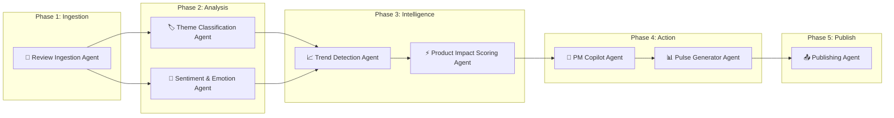
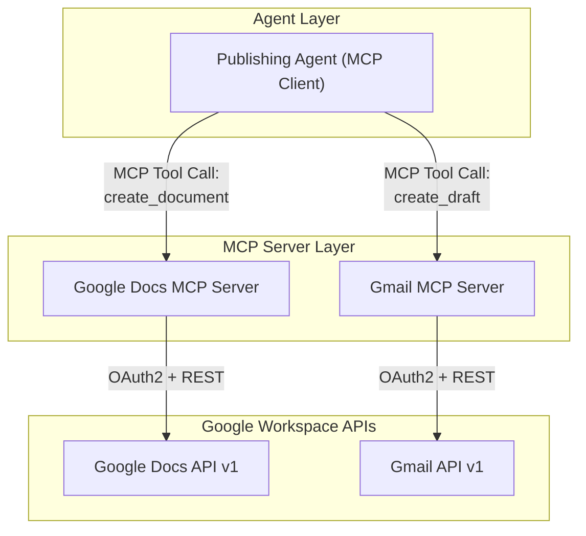
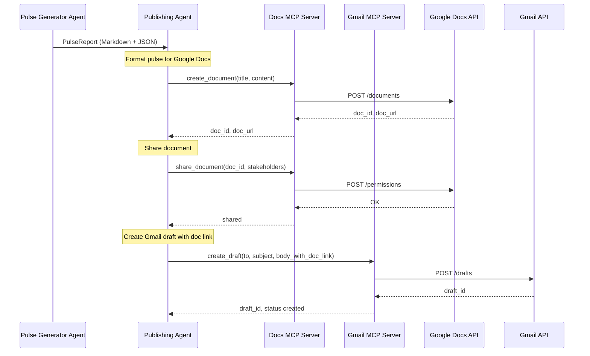
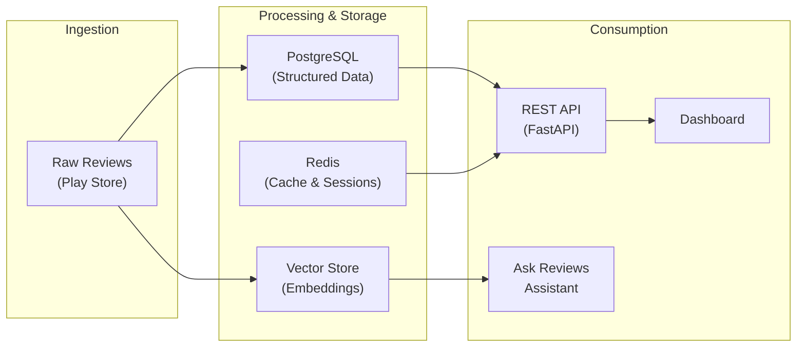

# Architecture — AI Product Intelligence Copilot for GROWW Reviews

> **Version**: 1.0  
> **Last Updated**: 2026-05-19  
> **Status**: Draft  

---

## Table of Contents

- [1. High-Level Architecture](#1-high-level-architecture)
- [2. Multi-Agent Orchestration Layer](#2-multi-agent-orchestration-layer)
- [3. MCP Integration Layer](#3-mcp-integration-layer)
- [4. Data Layer](#4-data-layer)
- [5. Executive Dashboard Architecture](#5-executive-dashboard-architecture)
- [6. Ask Reviews Assistant](#6-ask-reviews-assistant)
- [7. Infrastructure & Deployment](#7-infrastructure--deployment)
- [8. Security & Privacy](#8-security--privacy)
- [9. Technology Stack](#9-technology-stack)

---

## 1. High-Level Architecture

The system follows an **event-driven, multi-agent pipeline architecture** where specialized AI agents process raw app reviews through sequential stages to produce actionable product intelligence.



### Architectural Principles

| Principle | Description |
|-----------|-------------|
| **Agent Isolation** | Each agent has a single responsibility and well-defined I/O contract |
| **Structured Inter-Agent Communication** | Agents pass typed JSON schemas between stages |
| **MCP-Native Publishing** | Google Docs and Gmail integrations use Model Context Protocol servers |
| **Confidence-First AI** | Every AI output includes confidence scores for trust & explainability |
| **Privacy-by-Design** | No PII stored; all quotes anonymized at ingestion |

---

## 2. Multi-Agent Orchestration Layer

The orchestration layer is the core of the system. It manages 8 specialized agents in a **directed acyclic graph (DAG)** pipeline, where each agent produces structured output consumed by downstream agents.

### 2.1 Agent Pipeline



### 2.2 Agent Specifications

#### Agent 1 — Review Ingestion Agent

| Property | Detail |
|----------|--------|
| **Responsibility** | Scrape/fetch public Google Play Store reviews for the GROWW app |
| **Input** | App ID, date range (last 4–5 weeks) |
| **Output** | `List[ReviewRecord]` — structured review objects |
| **Key Logic** | Deduplication, language filtering, PII stripping, timestamp normalization |

**Output Schema:**
```json
{
  "review_id": "string",
  "text": "string (anonymized)",
  "rating": "int (1-5)",
  "date": "ISO-8601",
  "version": "string | null",
  "language": "string",
  "word_count": "int"
}
```

#### Agent 2 — Theme Classification Agent

| Property | Detail |
|----------|--------|
| **Responsibility** | Cluster reviews into max 5 product themes using LLM + embedding similarity |
| **Input** | `List[ReviewRecord]` |
| **Output** | `List[ThemeCluster]` with per-review assignments |
| **Key Logic** | Embedding-based clustering → LLM labeling → confidence scoring |
| **Model** | GPT-4o / Gemini Pro for labeling; text-embedding-3-small for vectors |

**Output Schema:**
```json
{
  "theme_id": "string",
  "theme_name": "string",
  "review_ids": ["string"],
  "review_count": "int",
  "ai_summary": "string",
  "classification_confidence": "float (0-1)"
}
```

#### Agent 3 — Sentiment & Emotion Agent

| Property | Detail |
|----------|--------|
| **Responsibility** | Assign sentiment polarity and emotion labels to each review |
| **Input** | `List[ReviewRecord]` |
| **Output** | Per-review sentiment + emotion annotations |
| **Key Logic** | LLM-based sentiment classification with fine-grained emotion (anger, frustration, satisfaction, delight, confusion) |

**Output Schema:**
```json
{
  "review_id": "string",
  "sentiment": "positive | negative | neutral | mixed",
  "sentiment_score": "float (-1 to 1)",
  "emotion": "string",
  "confidence": "float (0-1)"
}
```

#### Agent 4 — Trend Detection Agent

| Property | Detail |
|----------|--------|
| **Responsibility** | Detect weekly trends, anomalies, and regressions across themes |
| **Input** | Themed + sentiment-annotated reviews with timestamps |
| **Output** | `List[TrendSignal]` |
| **Key Logic** | Week-over-week comparison, spike detection, release-correlated regressions |

**Output Schema:**
```json
{
  "trend_id": "string",
  "theme_id": "string",
  "trend_type": "rising | declining | stable | spike | regression",
  "change_percent": "float",
  "description": "string",
  "related_version": "string | null",
  "confidence": "float (0-1)"
}
```

#### Agent 5 — Product Impact Scoring Agent

| Property | Detail |
|----------|--------|
| **Responsibility** | Generate composite impact scores per theme for prioritization |
| **Input** | Theme clusters, sentiment data, trend signals |
| **Output** | `List[ImpactScore]` with priority labels |
| **Key Logic** | Weighted formula: volume (20%) + negative_sentiment (25%) + rating_correlation (15%) + trend_acceleration (20%) + repeat_frequency (10%) + business_keyword_match (10%) |

**Output Schema:**
```json
{
  "theme_id": "string",
  "impact_score": "int (0-100)",
  "priority": "P0 | P1 | P2 | P3",
  "contributing_factors": {
    "volume_weight": "float",
    "sentiment_weight": "float",
    "rating_weight": "float",
    "trend_weight": "float",
    "repeat_weight": "float",
    "keyword_weight": "float"
  },
  "confidence": "float (0-1)"
}
```

#### Agent 6 — PM Copilot Recommendation Agent

| Property | Detail |
|----------|--------|
| **Responsibility** | Generate actionable product recommendations grounded in review evidence |
| **Input** | Impact-scored themes, trend signals, representative reviews |
| **Output** | `List[Recommendation]` |
| **Key Logic** | LLM generates recommendations with supporting evidence quotes; each recommendation linked to specific reviews |

**Output Schema:**
```json
{
  "recommendation_id": "string",
  "theme_id": "string",
  "title": "string",
  "description": "string",
  "evidence_quotes": ["string"],
  "priority": "P0 | P1 | P2 | P3",
  "confidence": "float (0-1)"
}
```

#### Agent 7 — Weekly Pulse Generator Agent

| Property | Detail |
|----------|--------|
| **Responsibility** | Compile all intelligence into a concise one-page executive pulse |
| **Input** | All upstream agent outputs |
| **Output** | Structured pulse document (Markdown + JSON) |
| **Key Logic** | Selects top 3 themes, 3 user quotes, trend changes, impact scores, recommendations, action items |

**Output Schema:**
```json
{
  "pulse_id": "string",
  "generated_at": "ISO-8601",
  "week_range": "string",
  "executive_summary": "string",
  "top_themes": ["ThemeSummary"],
  "trend_changes": ["TrendSignal"],
  "user_quotes": ["AnonymizedQuote"],
  "impact_scores": ["ImpactScore"],
  "recommendations": ["Recommendation"],
  "action_items": ["string"]
}
```

#### Agent 8 — Gmail/Docs Publishing Agent

| Property | Detail |
|----------|--------|
| **Responsibility** | Publish the weekly pulse to Google Docs and create a Gmail draft |
| **Input** | Rendered pulse document |
| **Output** | Google Doc URL + Gmail draft confirmation |
| **Key Logic** | Uses MCP servers for Docs and Gmail (see Section 3) |

### 2.3 Orchestrator Design

The orchestrator manages agent execution, error handling, and state persistence.

```python
# Pseudocode — Orchestrator
class PipelineOrchestrator:
    """
    Manages the DAG execution of the multi-agent pipeline.
    Supports retry, partial re-run, and state checkpointing.
    """
    def run_pipeline(self, config: PipelineConfig) -> PulseReport:
        # Stage 1: Ingestion
        reviews = self.ingestion_agent.run(config.app_id, config.date_range)

        # Stage 2: Analysis (parallel)
        themes = self.theme_agent.run(reviews)
        sentiments = self.sentiment_agent.run(reviews)

        # Stage 3: Intelligence (sequential)
        trends = self.trend_agent.run(themes, sentiments)
        impacts = self.impact_agent.run(themes, sentiments, trends)

        # Stage 4: Action
        recommendations = self.pm_agent.run(impacts, trends, reviews)
        pulse = self.pulse_agent.run(themes, sentiments, trends, impacts, recommendations)

        # Stage 5: Publish via MCP
        self.publish_agent.run(pulse, targets=["google_docs", "gmail"])

        return pulse
```

> [!IMPORTANT]
> **Agent 2 (Theme Classification) and Agent 3 (Sentiment & Emotion) run in parallel** since they both consume raw reviews independently. All other stages are sequential.

---

## 3. MCP Integration Layer

The system uses **Model Context Protocol (MCP)** servers to integrate with Google Docs and Gmail. MCP provides a standardized way for AI agents to interact with external tools and services.

### 3.1 MCP Architecture



### 3.2 Google Docs MCP Server

**Purpose:** Create and update Google Docs with the weekly pulse report.

| MCP Tool | Description | Parameters |
|----------|-------------|------------|
| `create_document` | Creates a new Google Doc with the pulse content | `title`, `content_markdown` |
| `update_document` | Updates an existing document | `doc_id`, `content_markdown` |
| `share_document` | Shares the doc with specified stakeholders | `doc_id`, `emails[]`, `permission` |
| `get_document_url` | Returns the shareable URL | `doc_id` |

**MCP Server Configuration:**
```json
{
  "mcpServers": {
    "google-docs": {
      "command": "npx",
      "args": ["-y", "@anthropic/mcp-google-docs"],
      "env": {
        "GOOGLE_CLIENT_ID": "${GOOGLE_CLIENT_ID}",
        "GOOGLE_CLIENT_SECRET": "${GOOGLE_CLIENT_SECRET}",
        "GOOGLE_REFRESH_TOKEN": "${GOOGLE_REFRESH_TOKEN}"
      }
    }
  }
}
```

### 3.3 Gmail MCP Server

**Purpose:** Create Gmail drafts with the weekly pulse for stakeholder distribution.

| MCP Tool | Description | Parameters |
|----------|-------------|------------|
| `create_draft` | Creates a Gmail draft with pulse content | `to[]`, `subject`, `body_html`, `attachments[]` |
| `send_email` | Sends the draft (optional, manual trigger) | `draft_id` |
| `list_drafts` | Lists existing drafts | `query`, `max_results` |

**MCP Server Configuration:**
```json
{
  "mcpServers": {
    "gmail": {
      "command": "npx",
      "args": ["-y", "@anthropic/mcp-gmail"],
      "env": {
        "GOOGLE_CLIENT_ID": "${GOOGLE_CLIENT_ID}",
        "GOOGLE_CLIENT_SECRET": "${GOOGLE_CLIENT_SECRET}",
        "GOOGLE_REFRESH_TOKEN": "${GOOGLE_REFRESH_TOKEN}"
      }
    }
  }
}
```

### 3.4 MCP Integration Flow



> [!NOTE]
> The Gmail integration creates **drafts** by default, not sent emails. This gives stakeholders a manual review step before distribution. The system can be configured to auto-send if desired.

---

## 4. Data Layer

### 4.1 Data Flow



### 4.2 Database Schema (Core Tables)

```sql
-- Reviews table
CREATE TABLE reviews (
    id UUID PRIMARY KEY,
    review_text TEXT NOT NULL,
    rating INT CHECK (rating BETWEEN 1 AND 5),
    review_date TIMESTAMP NOT NULL,
    app_version VARCHAR(20),
    language VARCHAR(10) DEFAULT 'en',
    word_count INT,
    ingested_at TIMESTAMP DEFAULT NOW(),
    week_number INT GENERATED ALWAYS AS (EXTRACT(WEEK FROM review_date))
);

-- Themes table
CREATE TABLE themes (
    id UUID PRIMARY KEY,
    pipeline_run_id UUID REFERENCES pipeline_runs(id),
    theme_name VARCHAR(100) NOT NULL,
    ai_summary TEXT,
    review_count INT,
    classification_confidence FLOAT,
    created_at TIMESTAMP DEFAULT NOW()
);

-- Sentiment annotations
CREATE TABLE sentiments (
    id UUID PRIMARY KEY,
    review_id UUID REFERENCES reviews(id),
    pipeline_run_id UUID REFERENCES pipeline_runs(id),
    sentiment VARCHAR(20) NOT NULL,
    sentiment_score FLOAT,
    emotion VARCHAR(30),
    confidence FLOAT
);

-- Trend signals
CREATE TABLE trends (
    id UUID PRIMARY KEY,
    pipeline_run_id UUID REFERENCES pipeline_runs(id),
    theme_id UUID REFERENCES themes(id),
    trend_type VARCHAR(20) NOT NULL,
    change_percent FLOAT,
    description TEXT,
    related_version VARCHAR(20),
    confidence FLOAT
);

-- Impact scores
CREATE TABLE impact_scores (
    id UUID PRIMARY KEY,
    pipeline_run_id UUID REFERENCES pipeline_runs(id),
    theme_id UUID REFERENCES themes(id),
    score INT CHECK (score BETWEEN 0 AND 100),
    priority VARCHAR(5),
    factors JSONB
);

-- Pipeline execution log
CREATE TABLE pipeline_runs (
    id UUID PRIMARY KEY,
    started_at TIMESTAMP DEFAULT NOW(),
    completed_at TIMESTAMP,
    status VARCHAR(20) DEFAULT 'running',
    config JSONB,
    error_log TEXT
);

-- Weekly pulses
CREATE TABLE pulses (
    id UUID PRIMARY KEY,
    pipeline_run_id UUID REFERENCES pipeline_runs(id),
    week_range VARCHAR(50),
    content_json JSONB,
    content_markdown TEXT,
    google_doc_url TEXT,
    gmail_draft_id TEXT,
    generated_at TIMESTAMP DEFAULT NOW()
);
```

### 4.3 Vector Store

| Property | Detail |
|----------|--------|
| **Engine** | ChromaDB (local dev) / Pinecone (production) |
| **Embedding Model** | `text-embedding-3-small` (OpenAI) or `text-embedding-004` (Google) |
| **Collection** | `groww_reviews` — stores review embeddings for semantic search |
| **Metadata** | `review_id`, `theme_id`, `sentiment`, `rating`, `week_number` |
| **Use Cases** | Ask Reviews assistant (RAG), theme clustering, similar review detection |

---

## 5. Executive Dashboard Architecture

### 5.1 Frontend Stack

| Component | Technology |
|-----------|-----------|
| **Framework** | Next.js 14+ (App Router) |
| **Styling** | Vanilla CSS with CSS Custom Properties (design tokens) |
| **Charts** | Recharts / Chart.js |
| **State Management** | React Context + SWR for data fetching |
| **Real-time** | WebSocket for Review Replay stream |

### 5.2 Dashboard Component Tree

```
App
├── Layout (Sidebar + Header)
│   ├── Navigation
│   └── DateRangeSelector
├── ExecutiveSummary
│   ├── SentimentScoreCard
│   ├── ReviewVolumeCard
│   ├── CriticalIssuesCard
│   ├── RatingTrendCard
│   └── RiskAlertCard
├── ThemeIntelligence
│   ├── ThemeCard (×5 max)
│   │   ├── SentimentBreakdownChart
│   │   ├── TrendIndicator
│   │   ├── SeverityBadge
│   │   ├── ImpactScoreGauge
│   │   └── AISummary
│   └── ThemeComparisonView
├── TrendDetectionPanel
│   ├── TrendTimeline
│   ├── AnomalyAlerts
│   └── ReleaseCorrelationView
├── PMRecommendations
│   ├── RecommendationCard (×N)
│   └── EvidenceDrawer
├── ReviewReplay
│   ├── ReviewStream
│   └── ReviewCard
│       ├── UserQuote
│       ├── RatingStars
│       ├── ThemeTag
│       ├── EmotionLabel
│       ├── SeverityIndicator
│       └── AITags
├── WeeklyPulse
│   ├── PulsePreview
│   ├── PublishControls (Docs + Gmail)
│   └── PulseHistory
└── AskReviewsAssistant
    ├── ChatInterface
    └── SuggestedQueries
```

### 5.3 API Endpoints

| Method | Endpoint | Description |
|--------|----------|-------------|
| `GET` | `/api/v1/dashboard/summary` | Executive summary cards |
| `GET` | `/api/v1/themes` | Theme clusters with analysis |
| `GET` | `/api/v1/themes/{id}/reviews` | Reviews in a theme |
| `GET` | `/api/v1/trends` | Trend signals |
| `GET` | `/api/v1/impact-scores` | Impact scores by theme |
| `GET` | `/api/v1/recommendations` | PM recommendations |
| `GET` | `/api/v1/reviews/stream` | WebSocket for review replay |
| `GET` | `/api/v1/pulses` | List generated pulses |
| `GET` | `/api/v1/pulses/{id}` | Specific pulse details |
| `POST` | `/api/v1/pulses/{id}/publish` | Trigger MCP publish (Docs + Gmail) |
| `POST` | `/api/v1/ask` | Ask Reviews assistant query |
| `POST` | `/api/v1/pipeline/run` | Trigger pipeline execution |
| `GET` | `/api/v1/pipeline/status/{id}` | Pipeline run status |

---

## 6. Ask Reviews Assistant

The conversational assistant uses a **RAG (Retrieval-Augmented Generation)** architecture backed by the vector store.

### 6.1 RAG Flow

```
User Query → Embedding → Vector Similarity Search → Context Assembly → LLM → Response
```

| Step | Detail |
|------|--------|
| **1. Query Embedding** | Embed user query using same model as review embeddings |
| **2. Retrieval** | Fetch top-K (K=10) similar reviews from vector store |
| **3. Context Assembly** | Combine retrieved reviews with theme/sentiment metadata |
| **4. LLM Generation** | Generate response using context-grounded prompt |
| **5. Citation** | Include anonymized quote references in response |

### 6.2 Example Queries Supported

- "What are users most frustrated about this week?"
- "Summarize UPI-related complaints"
- "Which issue should be prioritized?"
- "What changed after the latest release?"
- "Compare this week's sentiment to last week"

---

## 7. Infrastructure & Deployment

### 7.1 Deployment Topology

| Component | Environment |
|-----------|-------------|
| **Backend API** | FastAPI on Docker / Cloud Run |
| **Agent Pipeline** | Python workers (async, Celery or native asyncio) |
| **Frontend** | Next.js on Vercel / Docker |
| **Database** | PostgreSQL (Supabase / Cloud SQL) |
| **Vector Store** | ChromaDB (dev) / Pinecone (prod) |
| **Cache** | Redis (Upstash / ElastiCache) |
| **MCP Servers** | Co-located with backend or as sidecar containers |
| **Scheduler** | Cron job / Cloud Scheduler (weekly trigger) |

### 7.2 Deployment Diagram

```
┌─────────────────────────────────────────────────────┐
│                    Cloud Platform                     │
│                                                       │
│  ┌──────────┐  ┌──────────────┐  ┌───────────────┐  │
│  │ Frontend  │  │   Backend    │  │  MCP Servers  │  │
│  │ (Next.js) │  │  (FastAPI)   │  │ (Docs+Gmail)  │  │
│  │           │──│              │──│               │  │
│  │ Vercel /  │  │ Cloud Run /  │  │ Sidecar /     │  │
│  │ Docker    │  │ Docker       │  │ Co-located    │  │
│  └──────────┘  └──────────────┘  └───────────────┘  │
│                       │                               │
│         ┌─────────────┼─────────────┐                │
│         │             │             │                 │
│  ┌──────────┐  ┌──────────┐  ┌──────────┐           │
│  │PostgreSQL│  │  Redis   │  │ ChromaDB/│           │
│  │          │  │  Cache   │  │ Pinecone │           │
│  └──────────┘  └──────────┘  └──────────┘           │
└─────────────────────────────────────────────────────┘
```

---

## 8. Security & Privacy

### 8.1 Privacy Constraints

| Constraint | Implementation |
|------------|----------------|
| **No PII Storage** | Review Ingestion Agent strips usernames, emails, phone numbers before storage |
| **Anonymous Quotes** | All user quotes are anonymized — no attributable metadata |
| **No Identifiable Metadata** | User IDs, device IDs, and profile information are never stored |
| **Data Retention** | Reviews older than 8 weeks are archived/purged |

### 8.2 Security Measures

| Measure | Detail |
|---------|--------|
| **OAuth2** | Google Workspace API access via OAuth2 with scoped permissions |
| **Secret Management** | API keys and tokens stored in environment variables / secret manager |
| **API Authentication** | JWT-based auth for dashboard API endpoints |
| **Rate Limiting** | API rate limiting to prevent abuse |
| **CORS** | Strict CORS policy for frontend-backend communication |
| **Input Sanitization** | All user inputs to Ask Reviews assistant are sanitized |

---

## 9. Technology Stack

| Layer | Technology | Rationale |
|-------|-----------|-----------|
| **Backend** | Python 3.11+ / FastAPI | Async-native, excellent AI/ML ecosystem |
| **Agent Framework** | LangChain / LangGraph or Custom | Structured multi-agent orchestration |
| **LLM** | GPT-4o / Gemini Pro | High-quality text analysis and generation |
| **Embeddings** | text-embedding-3-small / text-embedding-004 | Cost-effective, high-quality vectors |
| **Frontend** | Next.js 14+ (React) | SSR, API routes, modern DX |
| **Styling** | Vanilla CSS (Custom Properties) | Full control, no framework lock-in |
| **Charts** | Recharts | React-native, composable charts |
| **Database** | PostgreSQL | Reliable, JSON support, mature ecosystem |
| **Vector DB** | ChromaDB / Pinecone | Semantic search for RAG |
| **Cache** | Redis | Fast caching, session management |
| **MCP (Docs)** | Google Docs MCP Server | Standardized AI-tool integration |
| **MCP (Gmail)** | Gmail MCP Server | Standardized AI-tool integration |
| **Task Queue** | Celery / asyncio | Background pipeline execution |
| **Deployment** | Docker + Cloud Run / Vercel | Scalable, containerized |

---

> [!TIP]
> This architecture is designed to be **incrementally buildable** — each phase in the implementation plan brings a new vertical slice of functionality. See `phase-wise-implementation.md` for the detailed build plan.
