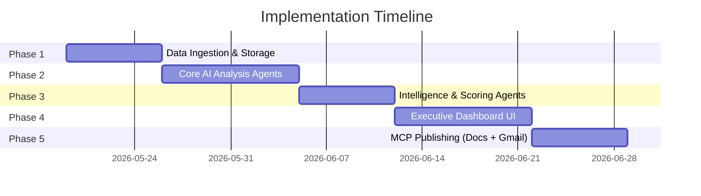
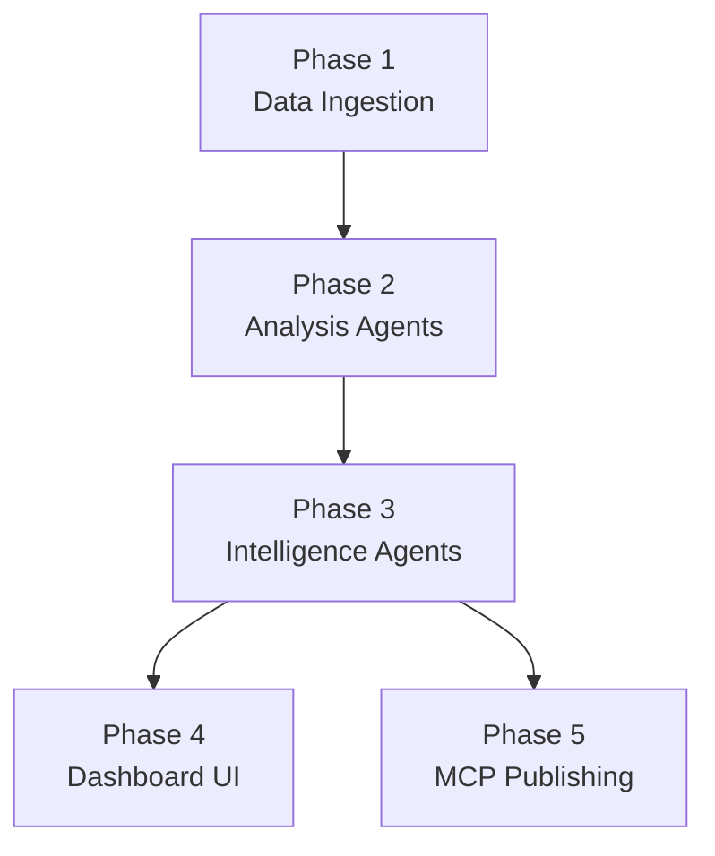

# Phase-Wise Implementation Plan

> **Version**: 1.0 | **Last Updated**: 2026-05-19 | **Total Phases**: 5

---

## Overview

This project is divided into **5 phases**, each delivering a testable vertical slice. Every phase has a corresponding `eval_phase_X.md` with detailed testing criteria.



---

## Phase 1 — Data Ingestion & Storage Foundation

**Duration**: ~1 week | **Eval**: [eval_phase_1.md](eval_phase_1.md)

### Goal
Build the Review Ingestion Agent and data storage layer to fetch, clean, and persist GROWW app reviews from Google Play Store.

### Deliverables

| # | Deliverable | Details |
|---|-------------|---------|
| 1 | **Review Ingestion Agent** | Fetch public reviews using `google-play-scraper` or Play Store API |
| 2 | **PII Stripping Module** | Remove usernames, emails, phone numbers from review text |
| 3 | **Database Schema** | PostgreSQL/SQLite tables: `reviews`, `pipeline_runs` |
| 4 | **Vector Store Setup** | ChromaDB collection with review embeddings |
| 5 | **Deduplication Logic** | Prevent duplicate reviews across pipeline runs |
| 6 | **Pipeline Runner (v1)** | Basic orchestrator that runs ingestion and stores results |

### Technical Tasks

```
1. Project scaffolding (Python backend with FastAPI)
2. Install dependencies: google-play-scraper, sqlalchemy, chromadb, openai/google-genai
3. Implement ReviewIngestionAgent class
   - fetch_reviews(app_id, date_range) → List[ReviewRecord]
   - strip_pii(text) → anonymized text
   - deduplicate(reviews) → unique reviews
4. Database setup with SQLAlchemy models
5. Vector store initialization and embedding pipeline
6. Basic FastAPI endpoint: POST /api/v1/pipeline/run
7. Environment configuration (.env, config.py)
```

### Key Decisions
- **Scraping Library**: `google-play-scraper` (Python) for Play Store reviews
- **Database**: SQLite for dev, PostgreSQL for prod
- **Embedding Model**: `text-embedding-3-small` (OpenAI) or `text-embedding-004` (Google)

---

## Phase 2 — Core AI Analysis Agents

**Duration**: ~10 days | **Eval**: [eval_phase_2.md](eval_phase_2.md)

### Goal
Build the Theme Classification Agent and Sentiment & Emotion Agent. These two agents run in parallel and form the analytical backbone of the pipeline.

### Deliverables

| # | Deliverable | Details |
|---|-------------|---------|
| 1 | **Theme Classification Agent** | Cluster reviews into ≤5 themes via embeddings + LLM labeling |
| 2 | **Sentiment & Emotion Agent** | Classify sentiment (positive/negative/neutral/mixed) + emotion labels |
| 3 | **Confidence Scoring** | Every classification includes a confidence score (0–1) |
| 4 | **Database Tables** | `themes`, `sentiments`, `review_theme_map` |
| 5 | **Agent I/O Contracts** | Typed Pydantic schemas for inter-agent communication |
| 6 | **Pipeline Runner (v2)** | Orchestrator runs Ingestion → Theme + Sentiment (parallel) |

### Technical Tasks

```
1. ThemeClassificationAgent
   - Embed all reviews using vector model
   - K-means / HDBSCAN clustering (k ≤ 5)
   - LLM-based theme naming and summary generation
   - Output: List[ThemeCluster] with confidence scores

2. SentimentEmotionAgent
   - LLM-based sentiment classification per review
   - Emotion detection: anger, frustration, satisfaction, delight, confusion
   - Batch processing for cost efficiency
   - Output: List[SentimentAnnotation] with confidence scores

3. Pydantic schemas for ReviewRecord, ThemeCluster, SentimentAnnotation
4. Update orchestrator for parallel execution of Agents 2 & 3
5. Persist results to database
6. API endpoints: GET /api/v1/themes, GET /api/v1/themes/{id}/reviews
```

### Key Decisions
- **Clustering**: HDBSCAN preferred (auto-selects cluster count) with LLM fallback for labeling
- **Parallel Execution**: `asyncio.gather()` for concurrent agent runs
- **Batch Size**: Process 50 reviews per LLM call to optimize cost

---

## Phase 3 — Intelligence & Scoring Agents

**Duration**: ~1 week | **Eval**: [eval_phase_3.md](eval_phase_3.md)

### Goal
Build the Trend Detection Agent, Product Impact Scoring Agent, and PM Copilot Recommendation Agent.

### Deliverables

| # | Deliverable | Details |
|---|-------------|---------|
| 1 | **Trend Detection Agent** | Week-over-week comparison, spike detection, release regressions |
| 2 | **Product Impact Scoring Agent** | Weighted composite score (0–100) with P0–P3 priority |
| 3 | **PM Copilot Recommendation Agent** | Actionable recommendations with evidence quotes |
| 4 | **Weekly Pulse Generator Agent** | Compile top 3 themes, quotes, trends, actions into one-page pulse |
| 5 | **Database Tables** | `trends`, `impact_scores`, `recommendations`, `pulses` |
| 6 | **Pipeline Runner (v3)** | Full pipeline: Ingestion → Analysis → Intelligence → Pulse |

### Technical Tasks

```
1. TrendDetectionAgent
   - Group reviews by week_number
   - Calculate week-over-week volume and sentiment changes per theme
   - Detect spikes (>2σ from mean) and release-correlated regressions
   - Output: List[TrendSignal]

2. ProductImpactScoringAgent
   - Weighted formula: volume(20%) + neg_sentiment(25%) + rating(15%)
     + trend_accel(20%) + repeat_freq(10%) + biz_keywords(10%)
   - Assign P0/P1/P2/P3 based on score thresholds
   - Output: List[ImpactScore]

3. PMCopilotAgent
   - LLM generates recommendations grounded in review evidence
   - Each recommendation has: title, description, evidence_quotes, priority
   - Output: List[Recommendation]

4. WeeklyPulseGeneratorAgent
   - Select top 3 themes by impact score
   - Select 3 representative anonymized quotes
   - Compile trend changes, scores, recommendations, action items
   - Output: PulseReport (JSON + Markdown)

5. API endpoints: GET /api/v1/trends, /impact-scores, /recommendations, /pulses
6. Full pipeline orchestration with error handling and checkpointing
```

### Key Decisions
- **Impact Score Weights**: Tunable via config; defaults documented above
- **Spike Threshold**: >2 standard deviations from rolling 4-week mean
- **Priority Mapping**: P0 (90–100), P1 (70–89), P2 (40–69), P3 (0–39)

---

## Phase 4 — Executive Dashboard UI

**Duration**: ~10 days | **Eval**: [eval_phase_4.md](eval_phase_4.md)

### Goal
Build the PM-focused executive dashboard with all visualization components and the Review Replay UI.

### Deliverables

| # | Deliverable | Details |
|---|-------------|---------|
| 1 | **Executive Summary Cards** | Sentiment score, review volume, critical issues, rating trend, risk alerts |
| 2 | **Theme Intelligence Panel** | 5 theme cards with sentiment breakdown, trend, severity, impact, summary |
| 3 | **Trend Detection Panel** | Timeline visualization, anomaly alerts, release correlation |
| 4 | **PM Recommendations Panel** | Recommendation cards with evidence drawers |
| 5 | **Review Replay UI** | Real-time review stream with theme/emotion/severity tags |
| 6 | **Weekly Pulse Preview** | Pulse viewer with publish controls |
| 7 | **Responsive Design** | Mobile-friendly, dark mode, glassmorphism aesthetics |

### Technical Tasks

```
1. Next.js project setup (App Router, vanilla CSS)
2. Design system: CSS custom properties, color palette, typography (Inter/Outfit)
3. Layout: sidebar navigation + header with date range selector
4. Executive Summary Cards (animated counters, sparklines)
5. Theme Intelligence section
   - Sentiment breakdown charts (Recharts)
   - Trend indicators (↑↓→ with percentage)
   - Impact score gauges
   - AI summary expandable sections
6. Trend Detection panel with timeline chart
7. PM Recommendations with collapsible evidence quotes
8. Review Replay stream (WebSocket or polling)
   - Review cards: quote, rating stars, theme tag, emotion, severity, AI tags
9. Weekly Pulse preview with formatted markdown rendering
10. Dark mode toggle, micro-animations, hover effects
11. SWR data fetching hooks for all API endpoints
```

### Design Requirements
- **Color Palette**: Dark theme with GROWW-inspired green accents (#00D09C)
- **Typography**: Inter for body, Outfit for headings
- **Animations**: Fade-in on scroll, counter animations, hover lifts
- **Charts**: Smooth gradients, rounded corners, tooltips

---

## Phase 5 — MCP Publishing (Google Docs + Gmail)

**Duration**: ~1 week | **Eval**: [eval_phase_5.md](eval_phase_5.md)

### Goal
Integrate Google Docs and Gmail via MCP servers for automated pulse publishing and stakeholder communication.

### Deliverables

| # | Deliverable | Details |
|---|-------------|---------|
| 1 | **Google Docs MCP Server** | Setup and configure MCP server for Docs API |
| 2 | **Gmail MCP Server** | Setup and configure MCP server for Gmail API |
| 3 | **Publishing Agent** | Agent 8 — orchestrates MCP calls for Docs + Gmail |
| 4 | **OAuth2 Setup** | Google Cloud project, OAuth consent, refresh tokens |
| 5 | **Pulse-to-Docs Formatter** | Convert pulse JSON/Markdown to Google Docs format |
| 6 | **Gmail Draft Creator** | Create draft with pulse summary + Docs link |
| 7 | **Dashboard Publish Controls** | UI buttons to trigger publish from dashboard |

### Technical Tasks

```
1. Google Cloud Project setup
   - Enable Google Docs API and Gmail API
   - Create OAuth2 credentials (web application type)
   - Generate refresh tokens with required scopes:
     - https://www.googleapis.com/auth/documents
     - https://www.googleapis.com/auth/gmail.compose
     - https://www.googleapis.com/auth/gmail.modify

2. MCP Server Configuration
   - Install and configure Google Docs MCP server
   - Install and configure Gmail MCP server
   - Test MCP tool calls independently

3. Publishing Agent Implementation
   - Format pulse content for Google Docs (headings, tables, charts)
   - Call create_document → get doc_url
   - Call share_document with stakeholder list
   - Format email body (HTML) with doc link + summary
   - Call create_draft with recipients and formatted body

4. Backend endpoint: POST /api/v1/pulses/{id}/publish
   - Accepts target: ["google_docs", "gmail", "both"]
   - Returns: {doc_url, draft_id, status}

5. Dashboard integration
   - "Publish to Docs" button with loading state
   - "Create Gmail Draft" button with confirmation
   - Status indicators (published, draft created)
   - Link to Google Doc and Gmail draft
```

### MCP Configuration Files

```json
// mcp_config.json
{
  "mcpServers": {
    "google-docs": {
      "command": "npx",
      "args": ["-y", "@anthropic/mcp-google-docs"],
      "env": {
        "GOOGLE_CLIENT_ID": "${GOOGLE_CLIENT_ID}",
        "GOOGLE_CLIENT_SECRET": "${GOOGLE_CLIENT_SECRET}",
        "GOOGLE_REFRESH_TOKEN": "${GOOGLE_REFRESH_TOKEN}"
      }
    },
    "gmail": {
      "command": "npx",
      "args": ["-y", "@anthropic/mcp-gmail"],
      "env": {
        "GOOGLE_CLIENT_ID": "${GOOGLE_CLIENT_ID}",
        "GOOGLE_CLIENT_SECRET": "${GOOGLE_CLIENT_SECRET}",
        "GOOGLE_REFRESH_TOKEN": "${GOOGLE_REFRESH_TOKEN}"
      }
    }
  }
}
```

---

## Phase Dependencies



> [!IMPORTANT]
> **Phase 4 and Phase 5 can run in parallel** since the dashboard and MCP publishing are independent.

---

## Risk Mitigation

| Risk | Mitigation |
|------|-----------|
| Play Store scraping rate limits | Implement exponential backoff + cache responses |
| LLM cost overruns | Batch processing, response caching, model tiering |
| MCP server compatibility | Test MCP servers early in Phase 5; have direct API fallback |
| OAuth token expiry | Implement automatic token refresh flow |
| Review volume spikes | Pagination + sampling for large review sets |
| Theme drift over time | Weekly re-clustering with historical anchoring |
